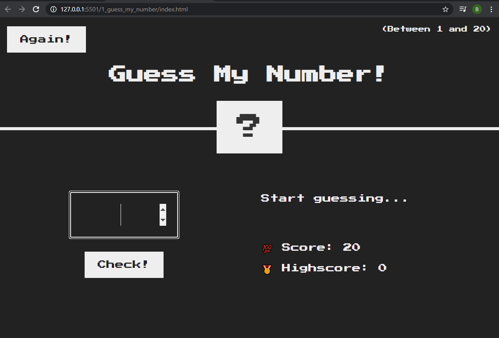
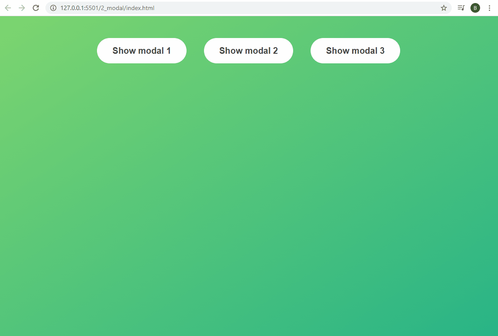
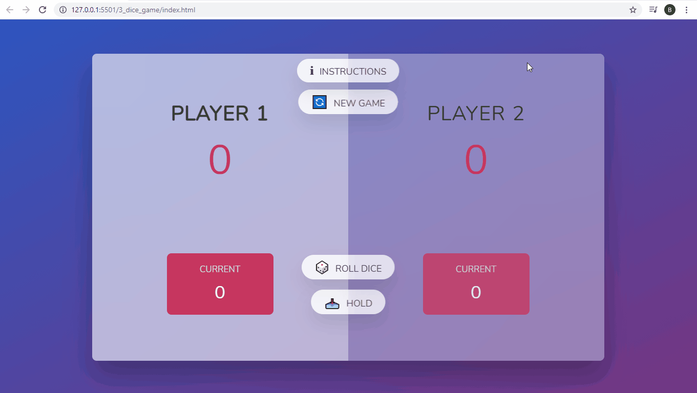
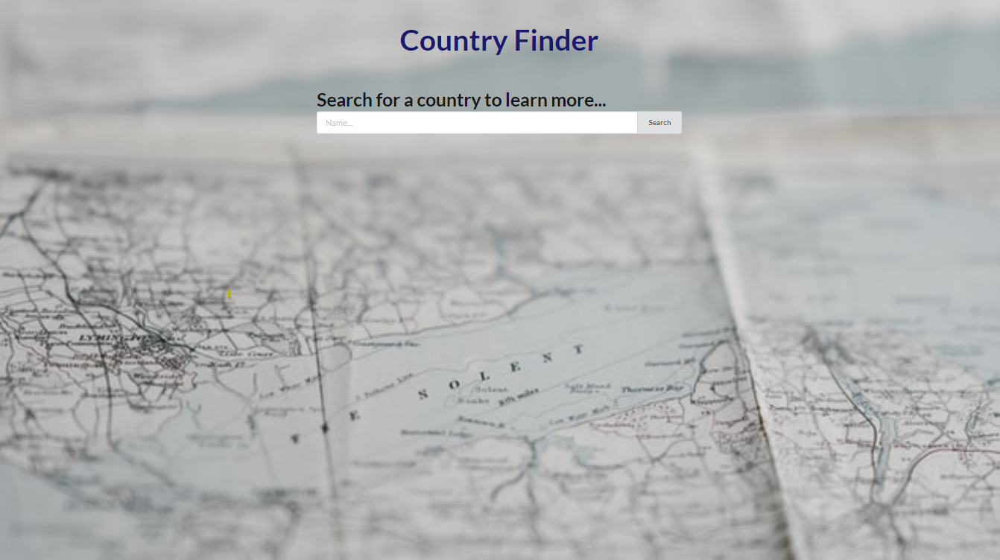
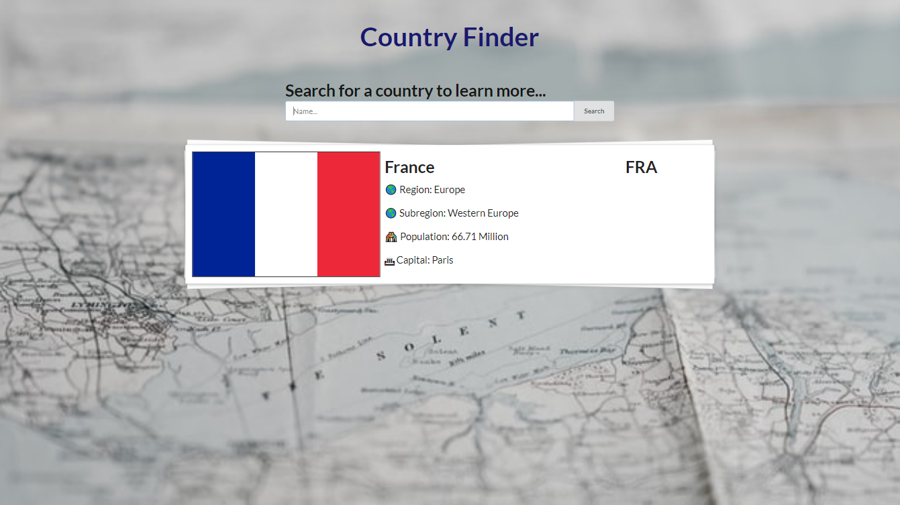

# JavaScript Mini Projects

## ℹ About
Building small projects with the aim being to consolidate JavaScript fundamentals.

## 🎥 Overview of Projects
### 1. Guess My Number
Practise DOM manipulation with a simple number guessing game.

### 2. Modals
Practise DOM manipulation + Modals.

### 3. Dice Game
Practise DOM manipulation and event handlers.
Simple dice rolling game.

### 4. Random Student Generator
Practise Javascript Promises. Code contains multiple <code>Promises</code> and chaining <code>.then</code>.
Names of students are listed in a text file. The app can generate a random name, shuffle the list and divide the list into equal size groups. 

### 5. Prompt Guess The Number
Practise Javascript Promises. Code contains multiple <code>Promises</code> with <code>resolve</code> and <code>reject</code> plus one <code>async</code> function to avoid *callback hell*.
Game using prompt window to guess a number. Points awarded based on how close the the number the guess is. Multiple goes increases the total score.

### 6. Countries
Practise fetch, promises and async function. Code contains an <code>async</code> function with <code>await</code> used for fetch calls. 
*Future* - Keen to implement React.
Search by country name to see facts about the country.

## 🚧 Under Construction
The collection will grow as I look for more ways to practise and improve specific skills.

## 📋 References

